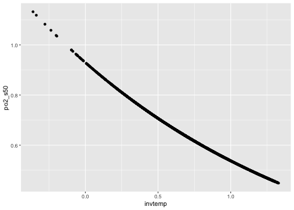
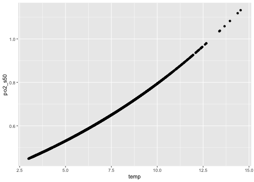

Estimating the metabolic index and its threshold effects within a
species distribution model with observation data
================

This vignette demonstrates using an optional estimation feature within
the sdmTMB R package developed and used in Indivero et al. (in prep).
This feature is specifically designed for using spatial data on oxygen,
temperature, and species density to estimate:

1.  The metabolic index, with an estimated parameter Eo.
2.  A threshold function of the effect of the metabolic index on fish
    density (with estimated parameters $s50$, $s95$, and scaling
    parameter $\psi$ (called `smax` in sdmTMB)).

This is done within the estimation model of a generalized linear mixed
model, i.e. simultaneously estimating covariates effects and spatial
random effects.

For further details on the equations of the metabolic index and the form
of the threshold function, see Indivero et al. (in prep).

Here, we will use as an example the data for sablefish (*Anoplopoma
fimbria*) from Indivero et al. This data is from 2010–2015 of the
National Oceanic and Atmospheric Administration West Coast Bottom Trawl
Survey, [Keller et
al. 2017](https://repository.library.noaa.gov/view/noaa/14179), spanning
Washington, Oregon, and California of the California Current.

## Downloading the branch

Currently, this feature is included in a separate branch of sdmTMB,
called `sdmTMB-newlogistic`. We plan to merge it into the main branch
soon. To install the package in R:

``` r
remotes::install_github("pbs-assess/sdmTMB", dependencies = TRUE, ref = "newlogistic")
```

``` r
library(sdmTMB)
library(ggplot2)
library(dplyr)
#> 
#> Attaching package: 'dplyr'
#> The following objects are masked from 'package:stats':
#> 
#>     filter, lag
#> The following objects are masked from 'package:base':
#> 
#>     intersect, setdiff, setequal, union
```

## Data Inputs

Load the example data:

``` r
dat <- readRDS("example_data.rds")
```

This model feature requires three columns in the data frame provided to
`sdmTMB()` (in addition to latitude and longitude, if a spatial model):

1.  **species density** (e.g., catch-per-unit-effort, or other response
    variable) (column can be named any valid column name)
2.  **oxygen** (must be in kiloPascals (kPa), and column must be named
    `po2`
3.  **temperature** (must be in inverse temperature and Kelvin, see
    below) and column must be named `invtemp`.

Any additional time variable or environmental covariates can be included
in the data at the same coordinates as the catch, temperature, and
oxygen data.

### Oxygen:

Oxygen needs to be in saturation of kPa. For example and functions of
how to convert from mL per L to kPa, see
[util_funs.R](https://github.com/jindivero/estimating_mi_from_distribution2/blob/f696e18bb8bf5b20d2127924eff033822d6fc2e4/Code/util_funs.R).

### Inverse temperature

Temperature needs to be inverse temperature, in Kelvin, and in reference
to a set temperature and corrected with Boltzmann’s constant in an
Arrhenius equation. Below is an example of converting temperature in
Celsius to the correct inverse temperature format.

``` r
# Constants
kelvin <- 273.15
boltz <- 0.000086173324
tref <- 12
# Calculate inverse temp
dat$invtemp <- (1 / boltz) * (1 / (dat$temp + 273.15) - 1 / (tref + 273.15))
```

### Species density

In this example, species density is catch-per-unit-effort, in biomass kg
km<sup>-2</sup>. We have not tested with other response variables,
though in theory this model could work with other measurements of
density (e.g., counts) or other response variables (e.g., size,
condition, etc.).

### Other covariates

The metabolic index threshold feature only requires oxygen, temperature,
and species density. However, spatial data, time data (e.g., year), and
other environmental covariates can also be included. In this example, we
also include year and depth as covariates.

``` r
head(dat)
#>   year        X        Y cpue_kg_km2       po2    temp log_depth_scaled
#> 1 2014 351.6881 5324.052    32.61283  5.827222  7.4782       -0.9597686
#> 2 2012 792.3716 3777.163     0.00000 10.859348 10.5229       -1.1876587
#> 3 2013 362.9463 5066.361   143.79006  2.651427  5.8467        0.3082887
#> 4 2013 804.0485 3776.391     0.00000  6.773678  9.5630       -1.1961495
#> 5 2014 603.0764 3986.402   346.62136  1.028859  3.9262        1.5764462
#> 6 2014 388.6977 5179.495    13.71160  4.031608  7.5299       -1.2312667
#>   log_depth_scaled2   invtemp
#> 1        0.92115574 0.6557432
#> 2        1.41053326 0.2119073
#> 3        0.09504193 0.8975586
#> 4        1.43077368 0.3508032
#> 5        2.48518269 1.1858576
#> 6        1.51601779 0.6481264
```

## Model Estimation

The Metabolic Index estimation is implemented using the standard
`sdmTMB()` (or `sdmTMB_cv()` for cross validation) function calls in
sdmTMB while adding `+ logistic(mi)` to the model equation. This can be
added in combination with most other model structure options in sdmTMB.
It can be used with or without temporal, spatial, and spatio-temporal
variation, and with other fixed effects in the model equation. However,
it cannot currently be used with another threshold variable or with
penalized smoothers. <!-- TODO: or a smoother SA: is this true!? -->

### Make a mesh for the SPDE

Next we construct a mesh to implement the SPDE approach:

``` r
mesh <- make_mesh(dat, xy_cols = c("X", "Y"), n_knots = 250)
```

### Fit model

In this example, we will fit a model of fish density to the metabolic
index in addition to year, and a quadratic effect of depth. We will
include spatial random variation, but not spatio-temporal variation, and
we will use a Tweedie observation distribution with a log link.

<!-- Additionally, to help with estimation, we are going to use starting values and use 2 "Newton loops" (additional optimization calls with a Newton optimizer).  -->

We will not use lower and upper bounds here, but the code below shows
where these can be added (see the `Inf` and `-Inf`). Starting values for
the threshold parameters can be specified in a matrix that is fed to the
`sdmTMB()` function (e.g., as in the `start` matrix in the example
below).

Note that there are four estimated parameters of the metabolic index
threshold feature (in order: `s50`, `s95`, `smax`, `Eo`), so if you want
to use any values for starting or bounds, it needs to be a vector
(matrix) of length (rows) four, with `NA`s for any parameter you do not
want to include a starting value for.

``` r
# Make starting values
start <- matrix(0, ncol = 1, nrow = 4)
start[1, 1] <- 2 # s50
start[2, 1] <- 2 # s95
start[3, 1] <- 30 # smax
start[4, 1] <- 0.3 # Eo

# Fit model
fit <- sdmTMB(
  cpue_kg_km2 ~ -1 + as.factor(year) + logistic(mi) + log_depth_scaled + log_depth_scaled2,
  data = dat,
  spatial = "on",
  spatiotemporal = "off",
  mesh = mesh,
  family = tweedie(link = "log"),
  silent = FALSE,
  control = sdmTMBcontrol(
    start = list(b_threshold = start),
    lower = list(b_threshold = c(-Inf, -Inf, -Inf, -Inf)),
    upper = list(b_threshold = c(Inf, Inf, Inf, Inf))
  )
)
#> ℹ Initiating `b_threshold` at specified starting value(s) of:
#> 2, 2, 30, 0.3
#> Setting lower limit for b_threshold to -Inf-Inf-Inf-Inf.
#> 
#> Setting upper limit for b_threshold to InfInfInfInf.
```

### Adding a prior

A prior can be added using `priors = sdmTMBpriors(threshold = ...)`.
Here, we will add a prior on `Eo` only by leaving the others as `NA`.

``` r
fit <- sdmTMB(
  cpue_kg_km2 ~ -1 + as.factor(year) + logistic(mi) + log_depth_scaled + log_depth_scaled2,
  data = dat,
  spatial = "on",
  spatiotemporal = "off",
  mesh = mesh,
  silent = FALSE,
  family = tweedie(link = "log"),
  control = sdmTMBcontrol(
    start = list(b_threshold = start),
    lower = list(b_threshold = c(-Inf, -Inf, -Inf, -Inf)),
    upper = list(b_threshold = c(Inf, Inf, Inf, Inf))
  ),
  priors = sdmTMBpriors(threshold = normal(c(NA, NA, NA, 0.3477), c(NA, NA, NA, 0.1455)))
)
#> ℹ Initiating `b_threshold` at specified starting value(s) of:
#> 2, 2, 30, 0.3
#> Setting lower limit for b_threshold to -Inf-Inf-Inf-Inf.
#> 
#> Setting upper limit for b_threshold to InfInfInfInf.
#> Warning: The model may not have converged. Maximum final gradient:
#> 0.0278395867662774.
```

## Interpreting Model Output

Standard sdmTMB functions can be used to evaluate the model fit.

First, we can run a ‘sanity’ check on our model:

``` r
sanity(fit, gradient_thresh = 0.01)
#> ✖ Non-linear minimizer did not converge: do not trust this model!
#> ℹ Try simplifying the model, adjusting the mesh, or adding priors
#> ✔ Hessian matrix is positive definite
#> ✔ No extreme or very small eigenvalues detected
#> ✖ `b_j` gradient > 0.01
#> ℹ See `?run_extra_optimization()`
#> ℹ Or refit with `control = sdmTMBcontrol(newton_loops = 1)`
#> ✖ `b_threshold` gradient > 0.01
#> ℹ See `?run_extra_optimization()`
#> ℹ Or refit with `control = sdmTMBcontrol(newton_loops = 1)`
#> ✖ `b_threshold` gradient > 0.01
#> ℹ See `?run_extra_optimization()`
#> ℹ Or refit with `control = sdmTMBcontrol(newton_loops = 1)`
#> ✔ No fixed-effect standard errors are NA
#> ✖ `b_threshold` standard error may be large
#> ℹ Try simplifying the model, adjusting the mesh, or adding priors
#> ✔ No sigma parameters are < 0.01
#> ✔ No sigma parameters are > 100
#> ✔ Range parameter doesn't look unreasonably large
```

The parameters estimated from the metabolic index and threshold function
start with the prefix `mi-` in the parameter list.

NOTE: The `s95` parameter value reported is actually a delta value
(difference between `s95` and `s50`). To calculate the value of `s95`
itself (i.e., the value of the metabolic index at which the logged
response on fish is a 95% reduction on density), add the reported
values: `s50 + s95`.

``` r
# View parameter estimates
summary(fit)
#> Spatial model fit by ML ['sdmTMB']
#> Formula: cpue_kg_km2 ~ -1 + as.factor(year) + logistic(mi) + log_depth_scaled + 
#>  Formula:     log_depth_scaled2
#> Mesh: mesh
#> Data: dat
#> Family: tweedie(link = 'log')
#>  
#>                     coef.est  coef.se
#> as.factor(year)2010     4.60     0.36
#> as.factor(year)2011     4.65     0.36
#> as.factor(year)2012     4.51     0.36
#> as.factor(year)2013     4.53     0.36
#> as.factor(year)2014     4.85     0.36
#> as.factor(year)2015     4.78     0.36
#> log_depth_scaled        1.55     0.08
#> log_depth_scaled2      -1.03     0.06
#> mi-s50                  0.93     0.16
#> mi-delta                0.49     0.12
#> mi-smax              2295.36 66792.87
#> mi-Eo                   0.55     0.14
#> 
#> Dispersion parameter: 16.04
#> Tweedie p: 1.52
#> Matern range: 91.30
#> Spatial SD: 1.94
#> ML criterion at convergence: 14540.349
#> 
#> See ?tidy.sdmTMB to extract these values as a data frame.

# Get AIC of model fit
AIC(fit)
#> [1] 29112.7
```

### Marginal effects

We can pull out the parameter estimates for the metabolic index
threshold feature to calculate the metabolic index from observed
temperature and oxygen and the marginal effect of the metabolic index on
fish density.

To evaluate how the response is impacted across the range of estimated
Eo values (e.g. the 95% confidence interval of the maximum likelihood
estimate) the function can be recreated:

``` r
## Extract parameters using tidy
par_estimates <- tidy(fit, conf.int = TRUE, effects = "fixed")
par_estimates_rand <- tidy(fit, conf.int = TRUE, effects = "ran_pars")
par_estimates <- bind_rows(par_estimates, par_estimates_rand)

# Or directly from model object
p <- as.list(fit$sd_report, "Estimate", report = TRUE)
s50 <- as.numeric(p$s50)
delta <- as.numeric(p$s95)
smax <- as.numeric(p$s_max)
Eo <- as.numeric(p$Eo)

## Calculate metabolic index
dat$metabolic_index <- dat$po2 * exp(Eo * dat$invtemp)

## Calculate marginal effect of threshold function
# Re-arrange parameters
a <- log(smax / (log(0.5) + smax) - 1)
b <- log(smax / (log(0.95) + smax) - 1)
beta0 <- -a + s50 * (b - a) / delta
beta1 <- (a - b) / delta
# Calculate
dat$effect <- exp(smax * (1 / (1 + exp(-beta0 - beta1 * dat$metabolic_index)) - 1))

## Plot
ggplot(dat, aes(x = metabolic_index, y = effect)) +
  geom_point()
```


### Threshold oxygen level across temperatures

The parameter estimates can also be used to calculate the values of
oxygen across a range of temperatures that correspond to the limiting
metabolic index threshold (either s50 or s95).

``` r
# For the s50 threshold
dat$po2_s50 <- s50 / exp(Eo * dat$invtemp)
# For the s95 threshold
s95 <- s50 + delta
dat$po2_s95 <- s95 / exp(Eo * dat$invtemp)

ggplot(dat, aes(x = invtemp, y = po2_s50)) +
  geom_point()
```



``` r

# Or with temperature in Celsius
ggplot(dat, aes(x = temp, y = po2_s50)) +
  geom_point()
```


